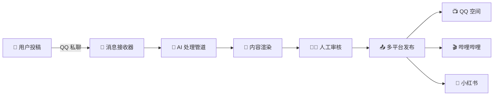

<div align="center">
  
  
  # Graffito - 校园墙自动运营系统
  
  
  
  
  
  
  🚀 **智能化校园墙自动运营解决方案**
  
  基于 Python + AI 的全自动校园墙系统，支持 QQ 消息接收、网页审核、智能内容处理、多平台自动发布

</div>

---

## ✨ 核心特性

<table>
<tr>
<td width="50%" align="center">

### 🤖 AI 智能化
- **全程 AI 驱动**：95% 流程自动化
- **智能安全审核**：内容安全 + 匿名判断
- **自适应处理**：智能合并消息与完整性检查

</td>
<td width="50%" align="center">

### 🚀 多平台发布
- **QQ 空间**：说说 + 图片批量发布
- **哔哩哔哩**：动态发布，账号管理
- **小红书**：图文笔记发布

</td>
</tr>
<tr>
<td width="50%" align="center">

### 🎨 内容渲染
- **模板引擎**：Jinja2 + HTML 美观渲染
- **图片生成**：Playwright 高质量渲染
- **水印添加**：自定义墙标识和水印

</td>
<td width="50%" align="center">

### 👨‍💼 审核管理
- **丰富指令**：是/否/匿/拒/立即等操作
- **团队协作**：管理群集成审核
- **定时发布**：多时段自动发布

</td>
</tr>
</table>

## 🏗️ 系统架构



## 🛠️ 技术栈

<div align="center">


</div>

## 📊 功能实现进度

- [x] QQ 接收器与发送器
- [x] 渲染器
- [x] LLM 审核
- [ ] 网页审核(Work)
- [ ] Bilibili 与小红书推送(Work)
- [ ] 微信接收器与发送器(企业微信或者 WeChatPadPro)


## 📚 文档

实在不想写,AI 写的太烂了,有人来写吗?

## 📁 项目结构

```
Graffito/
├── main.py              # 主程序入口
├── config/              # 配置文件
├── core/                # 核心功能 (数据模型、数据库)
├── processors/          # 处理管道 (LLM、渲染)
├── publishers/          # 发布器 (QQ空间、B站、小红书)
├── receivers/           # 接收器 (QQ消息接收)
├── services/            # 服务层 (审核、通知)
└── docs/                # 文档目录
```

## 🙏 感谢

- [gfhdhytghd/OQQWall](https://github.com/gfhdhytghd/OQQWall/)
- [aioqzone](https://github.com/aioqzone/aioqzone/)
- [xiaohongshu-mcp](https://github.com/xpzouying/xiaohongshu-mcp)
- [bilibili-api-python](https://github.com/nemo2011/bilibili-api)
- [Campux](https://github.com/idoknow/Campux)

---

<div align="center">


### 📄 开源协议

本项目基于 [MIT License](LICENSE) 开源协议，你可以自由使用、修改和分发。

<div style="text-align: center; margin-top: 20px; color: #666; font-size: 14px;">
  Made with ❤️ by the lilingfeng
</div>

</div>